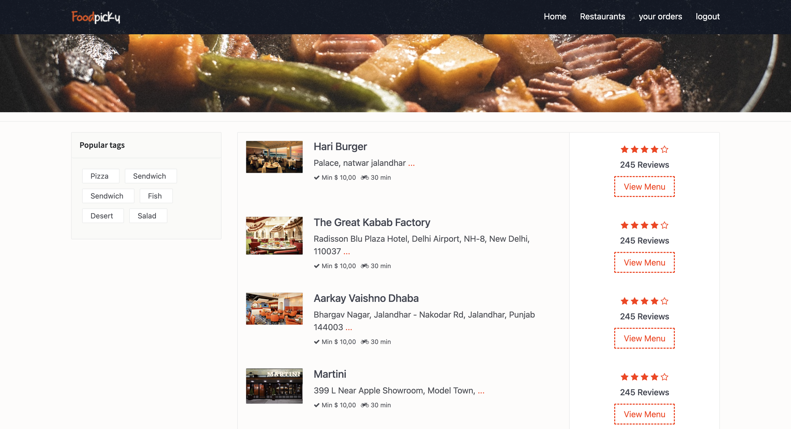
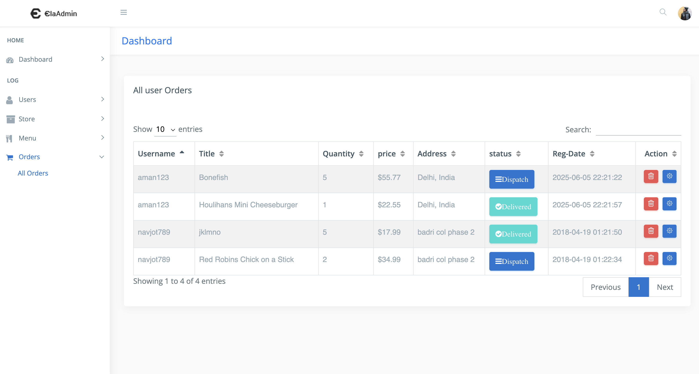

# 🍔 Food Ordering System

## 📌 About This Project

This is a simple web-based food ordering system where users can create an account, browse local restaurants, and place orders online.

---

## 🖼️ Project Views

- **Front-end View**: User interface for browsing food items and placing orders.

- **Back-end View**: Admin panel for managing food items, orders, and users.

---

## ⚙️ Installation / Demo Setup

1. Install **XAMPP**, **WAMP**, **MAMP**, or **LAMP** on your system.
2. Clone or download this repository to your local server directory (e.g., `htdocs` for XAMPP).
3. Open **phpMyAdmin** and create a new database.
4. Import the SQL file located in the `SQL/` folder into your newly created database.
5. Visit your local URL to start using the system.

---

## 🔐 Admin Dashboard

To access the admin panel, go to:

**Admin Login Credentials:**
- Username: `admin`
- Password: `1234`

---

## 🛠️ Technologies Used

- PHP  
- MySQL  
- Bootstrap 4  
- jQuery  
- AJAX

---

## 💻 System Requirements

- Local server environment (any one of the following):
  - XAMPP
  - WAMP
  - MAMP
  - LAMP
